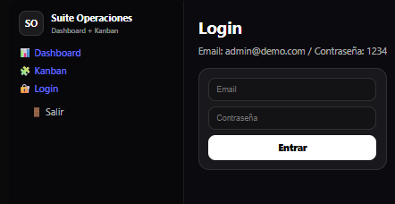
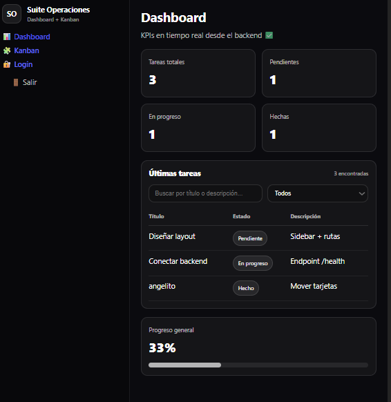
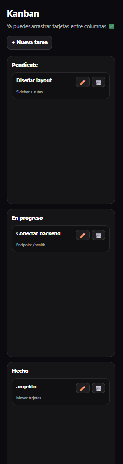

# Suite Operaciones (Dashboard + Kanban)

Aplicación fullstack para gestión de tareas tipo Trello, con Dashboard de KPIs en tiempo real y autenticación JWT.

## Preview




## 🔗 Demo en vivo
- **Frontend (Vercel):** https://suite-operaciones.vercel.app
- **Backend API (Render):** https://suite-operaciones.onrender.com
  - *Nota: la raíz `/` puede responder `Cannot GET /` (normal). Usa `/health` para verificar estado.*
- **Health check:** https://suite-operaciones.onrender.com/health

## Funcionalidades
- ✅ Login / Logout con JWT
- ✅ Rutas protegidas (si no hay token → /login)
- ✅ Kanban drag & drop (Pendiente / En progreso / Hecho)
- ✅ CRUD de tareas (crear, editar, eliminar)
- ✅ Persistencia en backend (API)
- ✅ Dashboard con KPIs + tabla de últimas tareas + barra de progreso

## Flujo de uso
1. Abrir la app → redirección a `/login` si no hay token.
2. Login con `admin@demo.com` / `1234`.
3. Redirección a `/dashboard`.
4. Dashboard y Kanban consumen la API enviando `Authorization: Bearer <token>`.
5. Token inválido/expirado → `401` → redirección a `/login`.
6. “Salir” borra el token y redirige a `/login`.

## Instalación (local)

### Requisitos
- Node.js 18+ recomendado

### Backend
```bash
cd backend
npm install
npm run dev
```
**Local API:** http://localhost:3001

### Frontend
```bash
cd frontend
npm install
npm run dev
```
**Local Front:** http://localhost:5173

### Variables de entorno (Frontend)
Crea un archivo `frontend/.env`:

```
VITE_API_URL=http://localhost:3001
```

En producción (Vercel) ya está configurado `VITE_API_URL=https://suite-operaciones.onrender.com`.

### Credenciales demo
- **Email:** admin@demo.com
- **Password:** 1234

## Endpoints principales (API)
| Método | Ruta | Descripción |
|--------|------|-------------|
| GET | `/health` | Verificar estado del backend |
| POST | `/auth/login` | Login (email, password) |
| GET | `/cards` | Listar tarjetas (requiere token) |
| POST | `/cards` | Crear tarjeta |
| PATCH | `/cards/:id` | Editar tarjeta |
| PATCH | `/cards/:id/move` | Mover tarjeta de columna |
| DELETE | `/cards/:id` | Eliminar tarjeta |

## Tecnologías
- **Frontend:** React + Vite, Axios
- **UI:** estilos inline (dark UI)
- **Drag & Drop:** dnd-kit
- **Backend:** Node.js + Express
- **Auth:** JWT